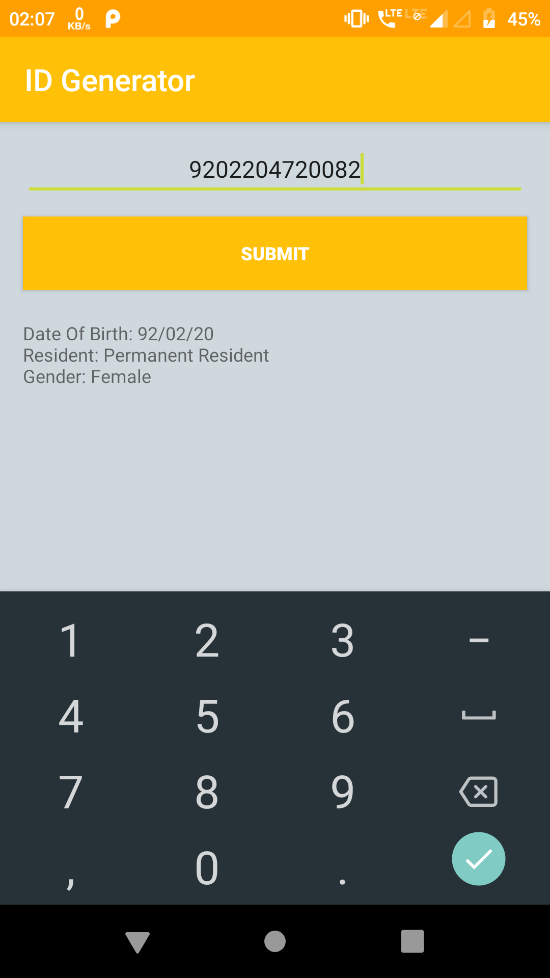
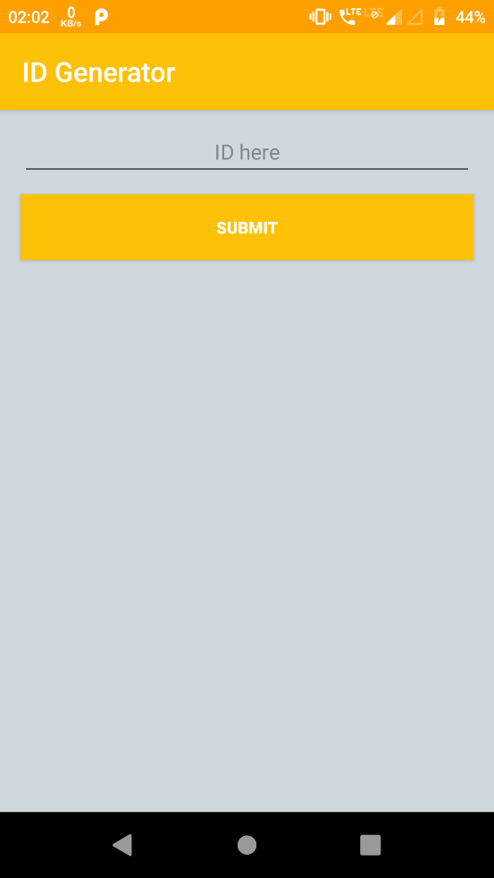

**IDGenerator**

It is a simple android application that decodes the south african ID number to
display the details of the holder.

South African ID number

A South African ID number is a 13-digit number which is defined by the following
format: YYMMDDSSSSCAZ.

-   The first 6 digits (YYMMDD) are based on your date of birth. 20 February
    1992 is displayed as 920220.

-   The next 4 digits (SSSS) are used to define your gender. Females are
    assigned numbers in the range 0000-4999 and males from 5000-9999.

-   The next digit (C) shows if you're an SA citizen status with 0 denoting that
    you were born a SA citizen and 1 denoting that you're a permanent resident.

for more details visit
https://www.westerncape.gov.za/general-publication/decoding-your-south-african-id-number-0

Getting Started

1. Clone the repository

2. In Android Studio, create a new project and choose the "Import non-Android
Studio Project" or "Import Project" option.

3. Run the app on emulator or on any android phone with android version 4.4(kit
kat) or above.

Sample run of Application

